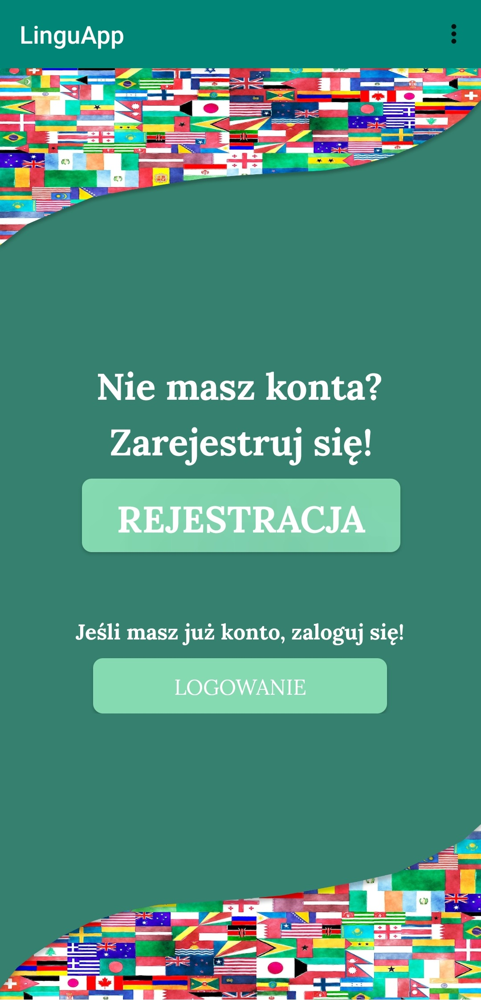
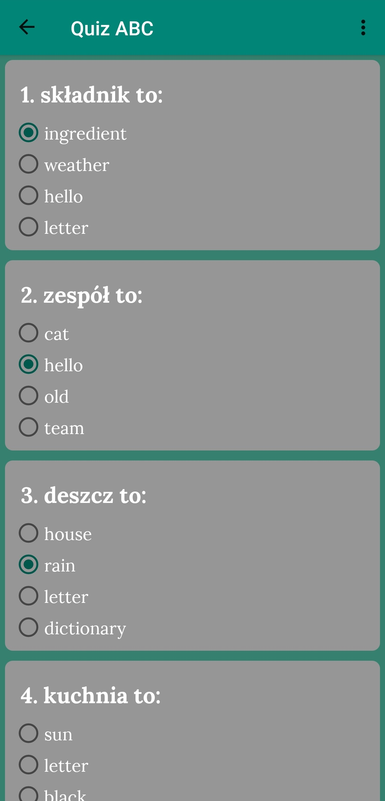
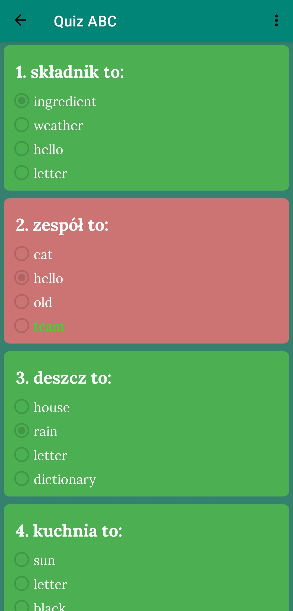
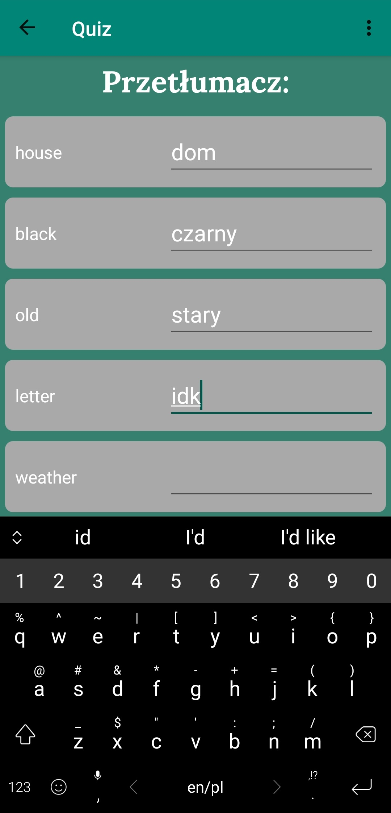
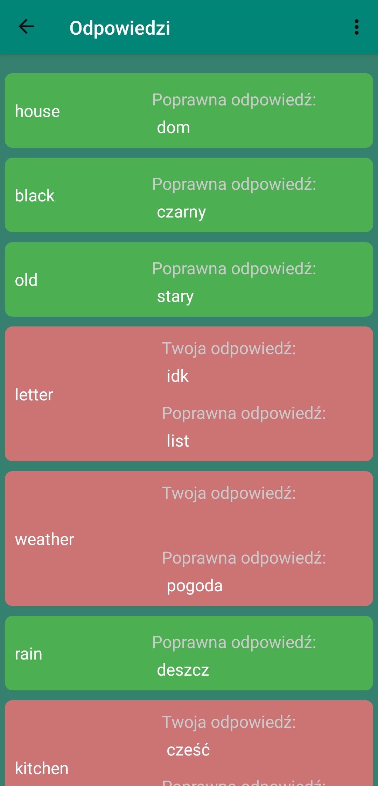
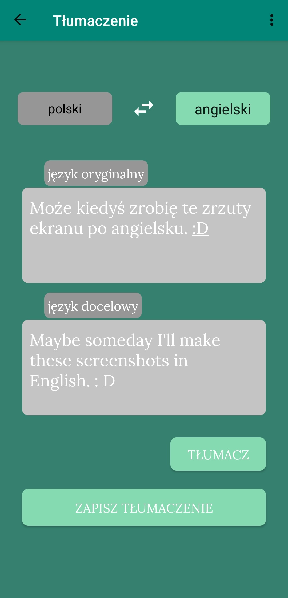

# LinguApp

The repository contains the source code and resources of the frontend of Lingu project. It's an Android App writen in Kotlin that enables users to quickly study new languages via various learning methods.

# What have I learned
* making asynchronous HTTP requests via Fuel library and Kotlin coroutines,
* RecycleView with nested interactive fields,
* Android Activity and Fragment life cycles,
* saving and restoring Activity/Fragment instances,
* write/read operations into local memory,
* animations and transitions,
* writing scalable FXML layouts,
* the use of SharedPreferences,
* event listeners of Views,
* navigation, passing arguments between Acitvities and Fragments.

# Quick peek on how does LinguApp look like

  
  
  

# Authors 
* **Ewa Sławińska** [Ewa2707](github.com/Ewa2707) — UX, design and the logo
* **Kamil Kwapisz** [KamilKwapisz](github.com/KamilKwapisz) — backend
* **Daniel Sporysz** [DanielSporysz](github.com/DanielSporysz) — frontend
